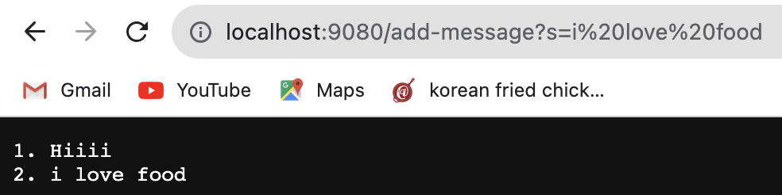
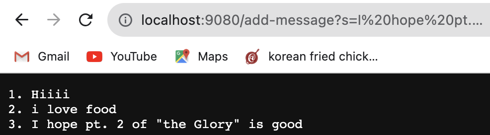

# CSE 15L Lab Report 2
## by Camille Saldajeno
___

### Part A
**StringServer code**

**add message screenshot 1**

1. The handlerRequest in Handler class is called
2. 

**add message screenshot 2**

