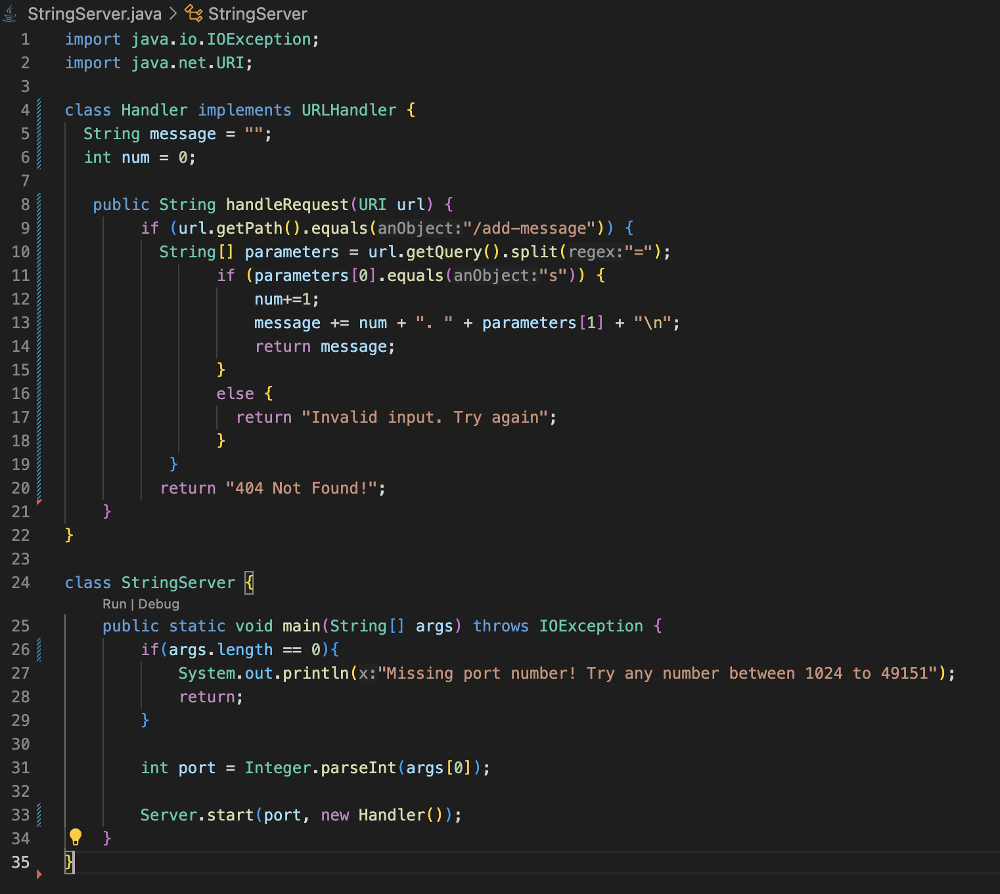

# CSE 15L Lab Report 2
## by Camille Saldajeno
___

### Part A
**StringServer code**

**add message screenshot 1**

* The handlerRequest in Handler class is called.
* The relevant arguments are the path `/add-message` and query parameter `s=i love food`, while the relavant fields are `message` and `num` of the Handler class.
* The  `message` and `nums` fields both change whenever a new string is added. The value "i love food" is added to the existing letters field and is printed after the previous update ('Hiiii') and nums is incremated by 1 after every new message.

**add message screenshot 2**

* The handlerRequest in Handler class is called.
* The relevant arguments are the path `/add-message` and query parameter `s=I hope pt. 2 of "the Glory" is good`, while the relavant fields are `message` and `num` of the Handler class.
* The  `message` and `nums` fields both change whenever a new string is added. The value "I hope pt. 2 of "the Glory" is good" is added to the existing letters field and is printed after the previous update ('i love food') and nums is incremated by 1 after every new message.

### Part B
